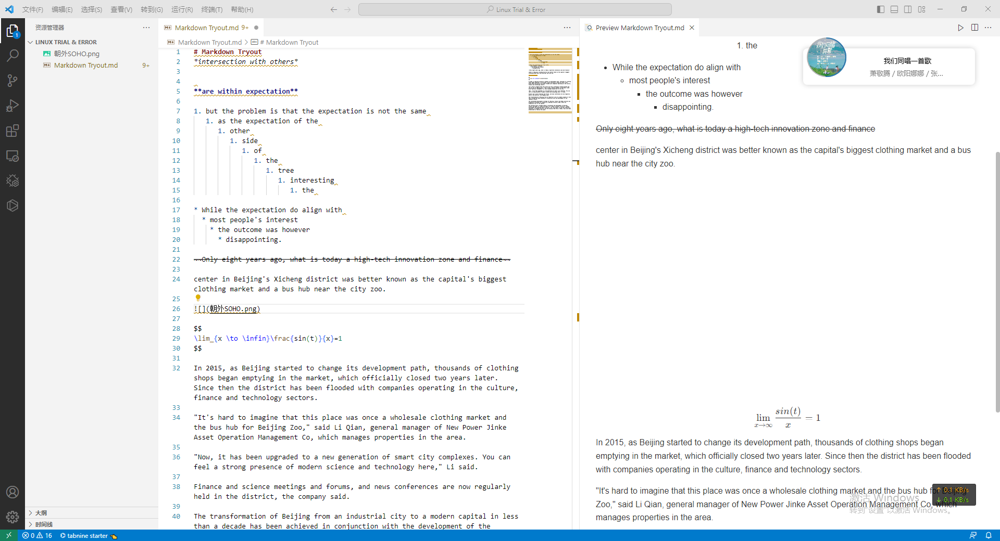

# Markdown Primer

<font size=6>"A brief introduction to the grammar of markdown language"</font>


<font size=5>1. Here's the way of displaying **different levels of titles** with various "#" before them, the lowest level of titles is done with six "#", plz be reminded that you should tap a space between "#" and "title":</font>
   
```
# caption 1
## caption 2
### caption 3
#### caption 4
##### caption 5
###### caption 6
```
# caption 1
## caption 2
### caption 3
#### caption 4
##### caption 5
###### caption 6
####### caption 7 -> see? "#" stops working after the sixth of them

-----


<font size=5>2. Here's how you change words into **italic style**: </font>

```
*intersection with others*
```

*intersection with others*

----

<font size=5>3. Here's how you change words into **bold style**: </font>

```
**are within expectation**
```
**are within expectation**

-----


<font size=5>4. Here's how you **underline selected words**: </font>

```
<u>are within expectation</u>
```

<u>are within expectation</u>

-----------
<font size=5>5. Giving the different lines their **orders of numbers** (use `tab` to differentiate different levels of titles):</font>

```
   1. but the problem is that the expectation is not the same 
   2. as the expectation of the 
      1. other 
         1. side 
            1. of 
               1. the 
                  1. tree
                     1. interesting 
                        1. the 
```

   1. but the problem is that the expectation is not the same 
   2. as the expectation of the 
      1. other 
         1. side 
            1. of 
               1. the 
                  1. tree
                     1. interesting 
                        1. the 

<font size=5>It seems that the number of lines goes on and on for ever. </font>

<font size=5>Well, if you happen to have a long list of things to do, you'll need a **to-do list**, it goes like this:</font>
```
- [ ] item 1 undone
+ [ ] item 2 undone
* [x] item 3 done
```

- [ ] item 1 undone
+ [ ] item 2 undone
* [x] item 3 done


==<font size=5>Please note that there exists single spaces between the brackets and -/+/*.</font>==


----

<font size=5>6. And giving a line its **dot order** (here too, use `tab` to differentiate different levels of titles):</font>

```
* While the expectation do align with 
  * most people's interest
    * the outcome was however
      * disappointing.
```

* While the expectation do align with 
  * most people's interest
    * the outcome was however
      * disappointing.
---

<font size=5>7. How do we **delete a line of words**? Like this:</font>
```
~~Only eight years ago, what is today a high-tech innovation zone and finance~~ center in Beijing's Xicheng district was better known as the capital's biggest clothing market and a bus hub near the city zoo.

```
~~Only eight years ago, what is today a high-tech innovation zone and finance~~ center in Beijing's Xicheng district was better known as the capital's biggest clothing market and a bus hub near the city zoo.


-----
<font size=5>8. And we can **establish a webpage link** with a pair of `<>`, just like this:</font>

```
All these were recorded in the webpage: <https://blog.csdn.net/u014061630/article/details/81359144?ops_request_misc=%257B%2522request%255Fid%2522%253A%2522169076791116800213051034%2522%252C%2522scm%2522%253A%252220140713.130102334..%2522%257D&request_id=169076791116800213051034&biz_id=0&utm_medium=distribute.pc_search_result.none-task-blog-2~all~top_positive~default-1-81359144-null-null.142^v91^control_2,239^v12^control2&utm_term=markdown%E8%AF%AD%E6%B3%95&spm=1018.2226.3001.4187>


Or you can just <font size=7>[Click Here](https://blog.csdn.net/u014061630/article/details/81359144?ops_request_misc=%257B%2522request%255Fid%2522%253A%2522169076791116800213051034%2522%252C%2522scm%2522%253A%252220140713.130102334..%2522%257D&request_id=169076791116800213051034&biz_id=0&utm_medium=distribute.pc_search_result.none-task-blog-2~all~top_positive~default-1-81359144-null-null.142^v91^control_2,239^v12^control2&utm_term=markdown%E8%AF%AD%E6%B3%95&spm=1018.2226.3001.4187)</font> to find out.
```


All these were recorded in the webpage: <https://blog.csdn.net/u014061630/article/details/81359144?ops_request_misc=%257B%2522request%255Fid%2522%253A%2522169076791116800213051034%2522%252C%2522scm%2522%253A%252220140713.130102334..%2522%257D&request_id=169076791116800213051034&biz_id=0&utm_medium=distribute.pc_search_result.none-task-blog-2~all~top_positive~default-1-81359144-null-null.142^v91^control_2,239^v12^control2&utm_term=markdown%E8%AF%AD%E6%B3%95&spm=1018.2226.3001.4187>


Or, you can just <font size=7>[Click Here](https://blog.csdn.net/u014061630/article/details/81359144?ops_request_misc=%257B%2522request%255Fid%2522%253A%2522169076791116800213051034%2522%252C%2522scm%2522%253A%252220140713.130102334..%2522%257D&request_id=169076791116800213051034&biz_id=0&utm_medium=distribute.pc_search_result.none-task-blog-2~all~top_positive~default-1-81359144-null-null.142^v91^control_2,239^v12^control2&utm_term=markdown%E8%AF%AD%E6%B3%95&spm=1018.2226.3001.4187)</font> to find out.

---
<font size=5>9. Here is a **picture** (a screen shot actually) saved as a png file, we <u>**place it in the directory of our .md file**</u> and display it with  
` `:</font>


```
` `
```
Here we type “``”


And here is another beautiful picture of Guanghua Rd's busy car flow at sundown, we type "``"


**Again!!! DO NOT forget to place the pic file in the directory of your .md file!!!**


----
<font size=5>10.  And here is a way of displaying a **math expression**:</font>
```
\lim_{x \to \infin}\frac{sin(t)}{x}=1
```


$$
\lim_{x \to \infin}\frac{sin(t)}{x}=1
$$
Concerning math expressions, markdown grammar is **compatable with LaTex**, and there are just so many of them, I can't type them all out together, find out more at: [LaTex Math Rules](https://blog.csdn.net/qq_38342510/article/details/124064158?ops_request_misc=%257B%2522request%255Fid%2522%253A%2522169078474616800186529229%2522%252C%2522scm%2522%253A%252220140713.130102334..%2522%257D&request_id=169078474616800186529229&biz_id=0&utm_medium=distribute.pc_search_result.none-task-blog-2~all~top_click~default-2-124064158-null-null.142^v91^control_2,239^v12^control2&utm_term=markdown%E6%95%B0%E5%AD%A6%E5%85%AC%E5%BC%8F&spm=1018.2226.3001.4187)


---
<font size=5>11.  Here is a line of code that shows how **code blocks** are displayed, you use four spaces to enter coding mode:</font>


    #include <studio.h>
    int main() {
      for(int i = 0; i <4; i++) {
         printf("Hello, world");
      }
    }

Or, in the way I prefer, it can be done by typing three `s on each side of the code, like this:
```
   #include <iostream>
   int main() {
      print("Hello, world");
      return 0;
   }
```

---
<font size=5>12. There is usually the need of **quoting** from other sources, we do it this way:</font>

```
> In 2015, as Beijing started to change its development path, thousands of clothing shops began emptying in the market, which officially closed two years later. Since then the district has been flooded with companies operating in the culture, finance and technology sectors.
```
> In 2015, as Beijing started to change its development path, thousands of clothing shops began emptying in the market, which officially closed two years later. Since then the district has been flooded with companies operating in the culture, finance and technology sectors.


```
>> "It's hard to imagine that this place was once a wholesale clothing market and the bus hub for Beijing Zoo," said Li Qian, general manager of New Power Jinke Asset Operation Management Co, which manages properties in the area.
>>"Now, it has been upgraded to a new generation of smart city complexes. You can feel a strong presence of modern science and technology here," Li said.
```
>> "It's hard to imagine that this place was once a wholesale clothing market and the bus hub for Beijing Zoo," said Li Qian, general manager of New Power Jinke Asset Operation Management Co, which manages properties in the area.
>>"Now, it has been upgraded to a new generation of smart city complexes. You can feel a strong presence of modern science and technology here," Li said.
----
<font size=5>13. Oh! We haven't had the chance to tell you how we draw that **thin gray line** under each paragraph, right? Type `---` or `***` or `___`, and it'll do the job:</font>
----

******

________
<font size=5>14. About the **fonts**, there is no easy way to change that, do it like this:</font>

```
<font face="黑体">超大特大城市积极稳步推进城中村改造</font>  
<font face="宋体">促进汽车更新消费 推进车位资源共享利用</font>  
<font face="仿宋">提升家装家居和电子产品消费</font>  
<font face="楷书">支持各地举办美食节 挖掘预制菜市场潜力</font>  
<font face="Arial">Finance and science meetings and forums</font>
<font face="Calibri">and news conferences are now regularly held in the district, the company said.</font>
<font face="Centruy Gothic">The transformation of Beijing from an industrial city to a modern capital in less than a decade</font>
<font face="Courier"> has been achieved in conjunction with the development of the regional cluster.</font>
```

<font face="黑体">超大特大城市积极稳步推进城中村改造</font>  
<font face="宋体">促进汽车更新消费 推进车位资源共享利用</font>  
<font face="仿宋">提升家装家居和电子产品消费</font>  
<font face="楷书">支持各地举办美食节 挖掘预制菜市场潜力</font>  
<font face="Arial">Finance and science meetings and forums</font>
<font face="Calibri">and news conferences are now regularly held in the district, the company said.</font>
<font face="Centruy Gothic">The transformation of Beijing from an industrial city to a modern capital in less than a decade</font>
<font face="Courier"> has been achieved in conjunction with the development of the regional cluster.</font>

----
<font size=5>15. And you can change the **size of the letters** in this way:</font>
```
<font size=4>The coordinated development strategy (size=4)</font>  
<font size=6>for Beijing, Tianjin and Hebei province (size=6)</font>  
<font size=10>was proposed by President Xi Jinping (size=10)</font>  
```
<font size=4>The coordinated development strategy (size=4)</font>  
<font size=6>for Beijing, Tianjin and Hebei province (size=6)</font>  
<font size=10>was proposed by President Xi Jinping (size=10)</font>  

---
<font size=5>16. How do we **highlight** or **centralize** certain parts of the sentence?</font>

```
<center><font size=7>News of the day</font></center>
At a meeting on ==Feb 26, 2014==, after his inspection tour of the capital. The ==national-level strategy== aimed to coordinate the development of ==Beijing, Tianjin and Hebei== to create the model for a ==better economic structure, cleaner environment and improved public services==. 
```


<center><font size=7>News of the day</font></center>
At a meeting on ==Feb 26, 2014==, after his inspection tour of the capital. The ==national-level strategy== aimed to coordinate the development of ==Beijing, Tianjin and Hebei== to create the model for a ==better economic structure, cleaner environment and improved public services==. 


<font size=5>17. Here's a **table** of China's GDP over the past few years:</font>
```
<center><font size=6>Economy & Population of China</center></font>
|Year|GPD(trillion Yuan)|GDP per capita(10k Yuan)|Population(billion)|
|:---|---:|:--:|----|
|1982|0.5373|0.05|10.17|
|1986|1.0376|0.1|10.75|
|2001|11.0863|0.87|12.76|
|2012|53.8580|3.98|13.59|
|2014|64.1281|4.69|13.77|
|2016|74.0061|5.38|13.92|
|2018|91.9281|6.55|14.05|
|2020|101.3567|7.18|14.12|
|2022|121.0207|8.57|14.12|
```


<center><font size=6>Economy & Population of China</center></font>
|Year|GPD(trillion Yuan)|GDP per capita(10k Yuan)|Population(billion)|
|:---|---:|:--:|:-:|
|1982|0.5373|0.05|10.17|
|1986|1.0376|0.1|10.75|
|2001|11.0863|0.87|12.76|
|2012|53.8580|3.98|13.59|
|2014|64.1281|4.69|13.77|
|2016|74.0061|5.38|13.92|
|2018|91.9281|6.55|14.05|
|2020|101.3567|7.18|14.12|
|2022|121.0207|8.57|14.12|

Two "new wings" of the hub — Beijing's subcenter in Tongzhou district and the Xiong'an New Area in Hebei, have also been established to realize this goal.

